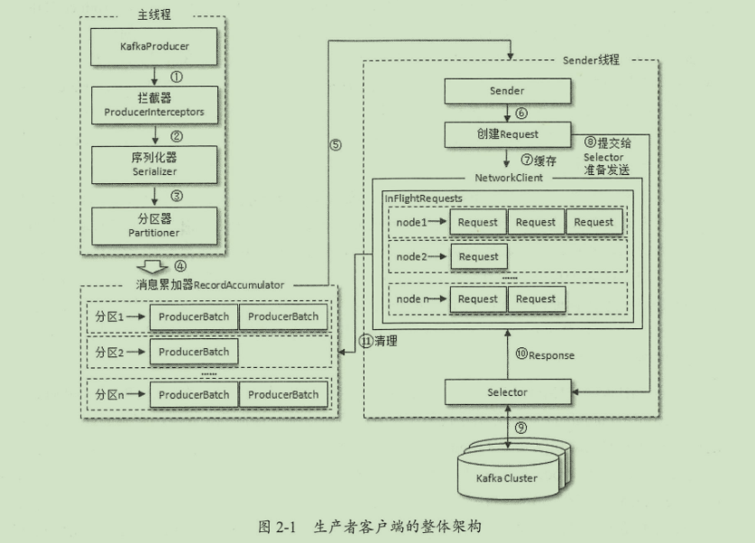

#### kafka脚本：

1. kafka启动：
    `$KAFKA_HOME/bin/kafka-server-start.sh config/server.properties`

2. kafka创建topic"topic-demo"，副本因子3，分区数4
    `$KAFKA_HOME/bin/kafka-topics.sh --zookeeper localhost:2181 -- create -- topic topic-demo -- replication-factor 3 -- partitions 4`

3. 主题信息查看
    `$KAFKA_HOME/bin/kafka-topics.sh --zookeeper localhost:2181 --describe --topic topic-demo

4. 消费信息
    `$KAFKA_HOME/bin/kafka-console-consumer.sh --bootstrap-server localhost:9092 --topic topic-demo`

5. 生产信息
    `$KAFKA_HOME/bin/kafka-console-producer.sh --broker-list localhost:9092 --topic topic-demo`

#### kafka主要配置参数：

- `broker.id`

  broker的编号，如果集群中有多个broker，则每个broker的编号需要设置不同，eg. `broker.id=0`

- `listeners`

  broker对外提供的服务入口地址，当主机有多个网卡时，配置kafka监听的网络地址，eg. `listeners=PLAINTEXT://localhost:9092`

- `zookeeper.connect`

  指定broker需要连接的zookeeper集群服务地址，多个节点用逗号隔开，如`localhost1:2181,localhost2:2181`。最佳实践再加一个chroot
  路径，便于多个kafka集群复用一套zookeeper集群如`localhost1:2181,localhost2:2181/kafka`，如果不指定chroot，默认使用根路径

- `log.dir/log.dirs`

  配置kafka日志文件存放的根目录，log.dirs优先级高，多个根目录使用`,`隔开，默认`/tmp/kafka-logs`

- `message.max.bytes`

  指定broker所能接收消息的最大值，默认1048588(≈1M)，

- `acks`

  用来指定分区中必须有多少个副本收到这条消息后生产者才会认为这条消息是成功写入的，是非常重要的参数，它涉及消息的可靠性和吞吐量之间的 权衡，acks有3种类型的值
    - acks = 1。默认值即为1.

#### kafka生产端

1. 架构

   

   生产者客户端有两个线程协调运行，分别为主线程和Sender线程。在主线程中由 `KafkaProducer` 创建消息，然后通过可能的拦截器、序列化器和 分区器的作用后缓存到消息累加器(`RecordAccumulator`
   ，也称为消息收集器)中。Sender线程负责从 `RecordAccumulator` 中获取消息并将其 发送到kafka中

   `RecordAccumulator`主要用来缓存消息以便Sender线程可以批量发送，从而减少网络传输的资源消耗以提升性能。主线程将多个`ProducerRecord`
   （取决于`batch.size`）封装到`ProducerBatch`中，并存入 `RecordAccumulator` 的双向队列中。Sender线程则将其队列中多个`ProducerBatch`
   封装成`Request`对象进一步减少网络开销提升性能

2. 元数据更新

   `InFlightRequests`：Sender线程在发送`Request`前会保存至`InFlightRequests`中，格式为`<NodeId, Deque<Request>>`，它的主要作用
   是缓存未收到响应的请求。通过此对象可以获得集群中负载最小的Node（未响应的请求越多则认为负载越大）`leastLoadedNode`。

   `元数据`指集群的brokers的地址、leader、topics、分区、分区的leader副本分配的节点等等数据，这些数据都会动态变化，客户端也需要动态捕捉
   这些变化。当客户端中没有需要的元数据或超过`metadata.max.age.ms(default 30000)`未更新元数据时都会引起元数据更新操作。更新元数据是在
   客户端内部操作的，对外透明。由Sender线程先选出`leastLoadedNode`，再向这个Node发送 `MetadataRequest` 请求来获取元数据信息并更新。

   
