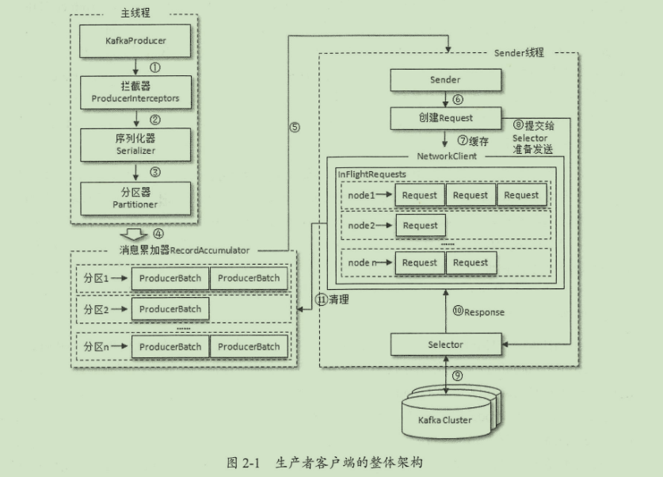

#### kafka脚本：

1. kafka启动**（需要关闭防火墙）**：
    `$KAFKA_HOME/bin/kafka-server-start.sh config/server.properties`

2. kafka创建topic"topic-demo"，副本因子3，分区数4
    `$KAFKA_HOME/bin/kafka-topics.sh --zookeeper localhost:2181 -- create -- topic topic-demo -- replication-factor 3 -- partitions 4`

3. 主题信息查看
    `$KAFKA_HOME/bin/kafka-topics.sh --zookeeper localhost:2181 --describe --topic topic-demo`

4. 消费信息
    `$KAFKA_HOME/bin/kafka-console-consumer.sh --bootstrap-server localhost:9092 --topic topic-demo`

5. 生产信息
    `$KAFKA_HOME/bin/kafka-console-producer.sh --broker-list localhost:9092 --topic topic-demo`

#### kafka主要配置参数：

- `broker.id`

  broker的编号，如果集群中有多个broker，则每个broker的编号需要设置不同，eg. `broker.id=0`

- `listeners`

  broker对外提供的服务入口地址，当主机有多个网卡时，配置kafka监听的网络地址，eg. `listeners=PLAINTEXT://localhost:9092`

- `zookeeper.connect`

  指定broker需要连接的zookeeper集群服务地址，多个节点用逗号隔开，如`localhost1:2181,localhost2:2181`。最佳实践再加一个chroot
  路径，便于多个kafka集群复用一套zookeeper集群如`localhost1:2181,localhost2:2181/kafka`，如果不指定chroot，默认使用根路径

- `log.dir/log.dirs`

  配置kafka日志文件存放的根目录，log.dirs优先级高，多个根目录使用`,`隔开，默认`/tmp/kafka-logs`

- `message.max.bytes`

  指定broker所能接收消息的最大值，默认1048588(≈1M)，

- #### [生产者](http://kafka.apache.org/documentation/#producerconfigs)
    - `bootstrap.servers`

      指定生产者客户端连接kafka集群所需的broker地址清单，格式为`host1:port1,host2:port2,`，建议至少设置两个以上的broker地址学习。

    - `key.serializer`、`value.serializer`

      key和value序列化操作的序列化器无默认值，必须为类的全限定名。

    - `acks`

      用来指定分区中必须有多少个副本收到这条消息后生产者才会认为这条消息是成功写入的，是非常重要的参数，它涉及消息的可靠性和吞吐量之间的 权衡，acks有3种类型的值
        - acks = 1。默认值即为1。发送消息后，只要分区leader副本成功写入消息，就会收到来自服务端成功响应。当无法写入leader副本，比如leader副本崩溃、重新选举
          leader副本的过程中，生产者会收到一个错误响应，为了避免消息丢失，生产者可以选择重发消息。如果消息写入leader并返回成功响应给生产者，且在被其他follower
          副本拉取之前leader副本崩溃，此时消息还是会丢失。acks设置为1是消息可靠性和吞吐量的折中方案。

        - acks = 0。生产者发送消息后不需要等待任何服务端的响应。如果在消息从发送到写入Kafka的过程中出现某些异常，导致Kafka并没有收到这条消息，那么生产者也无从得知，
          消息也就丢失了。acks设置为0，,集群可达到最大吞吐量。

        - acks=-1或acks=all。生产者发送消息后，需要等待ISR中所有副本都成功写入后才能收到服务端的成功响应。此时集群有最强的可靠性。但这并不意味着消息就一定可靠，因为
          ISR中可能只有leader副本，这样就退化成了acks=1的情况。

    - `retries`

      生产者重试次数，默认值为0

    - `retry.backoff.ms`

      设定重试之间的间隔，避免无效的频繁重试。

    - `max.request.size`

      生产者客户端能发送的消息最大值，默认为1048576B，即1MB。

- #### [消费者](http://kafka.apache.org/documentation/#consumerconfigs)
    - `bootstrap.servers`

      集群broker地址清单

    - `group.id`

      消费者隶属的消费者组名，默认值为""，

    - `key.deserializer`、`value.deserializer`

      key和value反序列化器

#### kafka生产端

1. 架构

   

   生产者客户端有两个线程协调运行，分别为主线程和Sender线程。在主线程中由 `KafkaProducer` 创建消息，然后通过可能的拦截器、序列化器和分区器的作用后缓存到消息累加器(`RecordAccumulator`
   ，也称为消息收集器)中。Sender线程负责从 `RecordAccumulator` 中获取消息并将其发送到kafka中

   `RecordAccumulator`主要用来缓存消息以便Sender线程可以批量发送，从而减少网络传输的资源消耗以提升性能。主线程将多个`ProducerRecord`
   （取决于`batch.size`）封装到`ProducerBatch`中，并存入 `RecordAccumulator` 的双向队列中。Sender线程则将其队列中多个`ProducerBatch`
   封装成`Request`对象进一步减少网络开销提升性能

2. 元数据更新

   `InFlightRequests`：Sender线程在发送`Request`前会保存至`InFlightRequests`中，格式为`<NodeId, Deque<Request>>`，它的主要作用
   是缓存未收到响应的请求。通过此对象可以获得集群中负载最小的Node（未响应的请求越多则认为负载越大）`leastLoadedNode`。

   `元数据`指集群的brokers的地址、leader、topics、分区、分区的leader副本分配的节点等等数据，这些数据都会动态变化，客户端也需要动态捕捉
   这些变化。当客户端中没有需要的元数据或超过`metadata.max.age.ms(default 30000)`未更新元数据时都会引起元数据更新操作。更新元数据是在
   客户端内部操作的，对外透明。由Sender线程先选出`leastLoadedNode`，再向这个Node发送 `MetadataRequest` 请求来获取元数据信息并更新。

#### kafka消费端

- 消费组

  消费者分组，一个topic中的消息只投递给同一组消费者中的一个消费者，相当于组播，通过消费者客户端参数`group.id`来配置。并且**每个分区只能被同一消费组中的一个消费者所消费**。
  当同一分组中消费者数小于分区数，再增加消费者时，按照既定的逻辑，会将原来消费者(消费分区数大于1)消费 的部分分区分配给新加入的消费者，整体的
  消费能力具备横向收缩性。对于分区数固定的情况，当一个消费者组中的消费者数大于主题的分区数时，多余 部分的消费者会因分配不到任何分区 而无法
  消费任何消息。可以通过消费者客户端参数`partition.assignment.strategy`来设置消费者与订阅主题之间的分区分配策略。
  
- 客户端开发 [**示例**](KafkaComplexConsumer.java)

    正常的消费逻辑：
    - 配置消费者客户端参数及创建相应的消费者实例
    - 订阅主题
    - 拉取消息并消费
    - 提交消费位移（关系到消息的丢失和重消费）
    - 关闭消费者实例
