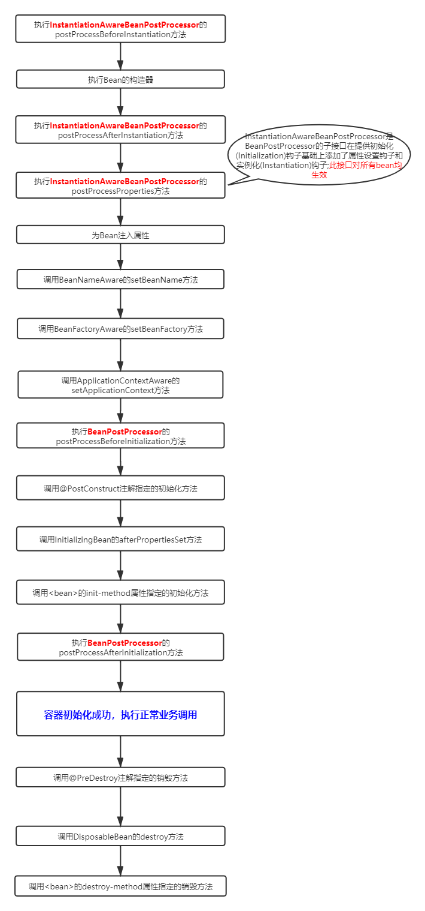

### 																															Spring相关知识点

------


#### **Core**

##### bean的生命周期




##### 相关xml配置

###### 1、开启注解

 `<context:annotation-config/>`和 `<context:component-scan/>`的 [区别](https://stackoverflow.com/questions/7414794/difference-between-contextannotation-config-and-contextcomponent-scan) ，前者不能自动扫描包中的bean进行注册，后者能配置指定的包进行bean扫描和自动注册


##### 常用接口

###### 生命周期接口

**全局：** `InstantiationAwareBeanPostProcessor`

**个体：** `BeanNameAware`，`BeanFactoryAware`，`ApplicationContextAware`，`InitializingBean`，`DisposableBean`

###### 其他接口

1、`FactoryBean`接口

- `Object getObject()`：返回此工厂创建的对象的实例。实例可以共享，具体取决于该工厂是否返回单例或原型。
- `boolean isSingleton()`：`true`如果`FactoryBean`返回单例或`false`其他则返回 。
- `Class getObjectType()`：返回`getObject()`方法返回的对象类型，或者`null`如果类型未知则返回该对象类型。


##### 注解

###### 自动注入注解

 `@Required`，`@Autowired`，`@Primary`， `@Qualifier` ， `@Resource`， `@Value`， `@PropertySource`

`@Inject`，`@Named`

###### 生命周期注解

`@PostConstruct`，`PreDestroy`

###### Bean声明注解

 `@Component`，`@Service`， `@Repository`， `@Controller`

`@Scope`

###### 配置注解

`@Bean`，`@Configuration`，`@ComponentScan`，`@Import`， `@ImportResource`


##### 事件

###### 事件类型

 **内置事件：**`ContextRefreshedEvent`， `ContextStartedEvent`， `ContextStoppedEvent` ， `ContextClosedEvent` ， `RequestHandledEvent` ， `ServletRequestHandledEvent` 

**自定义事件**须继承 `ApplicationEvent`

###### 接口

**发布事件接口：** `ApplicationEventPublisherAware`

**监听事件接口：**`ApplicationListener` ，`@EventListener` 

##### AOP

###### 概念

切面(Aspect)：对横切关注点的抽象； 一个关注点的模块化，这个关注点实现可能另外横切多个对象 

连接点(JoinPoint)：被拦截到的点，在spring中一般是方法

切入点(Pointcut)： 指定一个通知将被引发的一系列连接点的集合 

通知(Advice)：在特定连接点需要执行的操作。包括"around"，"before"，"throws"等类型

目标导向(TargetObject)：包含连接点的对象，也被称作被代理对象

###### 使用spring aop

1、开启spring aop

**Java config**

```java
@Configuration
@EnableAspectJAutoProxy
public class AppConfig {

}
```

**Xml config**

```xml
<aop:aspectj-autoproxy/>
```

###### [Pointcut表达式](https://blog.csdn.net/java_green_hand0909/article/details/90238242)

 可以通过 &&、 ||、 !、 的方式进行组合 

- execution：用于匹配方法执行的连接点；
- within：用于匹配指定类型内(**指所实现的接口**)的方法执行；
- this：用于匹配当前AOP代理对象(**创建的代理对象**)类型的执行方法；注意是AOP代理对象的类型匹配，这样就可能包括引入接口的类型匹配；    
- target：用于匹配当前目标对象(**需要代理的对象**)类型的执行方法；注意是目标对象的类型匹配，这样就不包括引入接口的类型匹配；
- args：用于匹配当前执行的方法传入的参数为指定类型的执行方法；
- @within：用于匹配所以持有指定注解类型内的方法；
- @target：用于匹配当前目标对象类型的执行方法，其中目标对象持有指定的注解；
- @args：用于匹配当前执行的方法传入的参数持有指定注解的执行；
- @annotation：用于匹配当前执行方法持有指定注解的方法；

**格式**：

```
execution(modifiers-pattern? ret-type-pattern declaring-type-pattern?name-pattern(param-pattern)
                throws-pattern?)
```

其中后面跟着“?”的是可选项

括号中各个pattern分别表示：

- 修饰符匹配（modifier-pattern?）
- 返回值匹配（ret-type-pattern）：  可以为*表示任何返回值, 全路径的类名等
- 类路径匹配（declaring-type-pattern?）
- 方法名匹配（name-pattern）：可以指定方法名 或者 *代表所有, set* 代表以set开头的所有方法
- 参数匹配（(param-pattern)）：可以指定具体的参数类型，**多个参数间用“,”隔开，各个参数也可以用"\*" 来表示匹配任意类型的参数，".."表示零个或多个任意参数。**
  如(String)表示匹配一个String参数的方法；(*,String) 表示匹配有两个参数的方法，第一个参数可以是任意类型，而第二个参数是String类型。
- 异常类型匹配（throws-pattern?）

**eg.**

- 任意公共方法的执行：execution(public * *(..))
- 任何一个以“set”开始的方法的执行：execution(* set*(..))
- AccountService 接口的任意方法的执行：execution(* com.xyz.service.AccountService.*(..))
- 定义在service包里的任意方法的执行： execution(* com.xyz.service.*.*(..))
- 定义在service包和所有子包里的任意类的任意方法的执行：execution(* com.xyz.service..*.*(..))
  第一个*表示匹配任意的方法返回值， ..(两个点)表示零个或多个，第一个..表示service包及其子包,第二个*表示所有类, 第三个*表示所有方法，第二个..表示方法的任意参数个数
- 定义在pointcutexp包和所有子包里的JoinPointObjP2类的任意方法的执行：execution(* com.test.spring.aop.pointcutexp..JoinPointObjP2.*(..))")
- pointcutexp包里的任意类： within(com.test.spring.aop.pointcutexp.*)
- pointcutexp包和所有子包里的任意类：within(com.test.spring.aop.pointcutexp..*)
- 实现了Intf接口的所有类,如果Intf不是接口,限定Intf单个类：this(com.test.spring.aop.pointcutexp.Intf)
  当一个实现了接口的类被AOP的时候,用getBean方法必须cast为接口类型,不能为该类的类型
- 带有@Transactional标注的所有类的任意方法： 
  - @within(org.springframework.transaction.annotation.Transactional)
  - @target(org.springframework.transaction.annotation.Transactional)
- 带有@Transactional标注的任意方法：@annotation(org.springframework.transaction.annotation.Transactional)
  @within和@target针对类的注解,@annotation是针对方法的注解
- 参数带有@Transactional标注的方法：@args(org.springframework.transaction.annotation.Transactional)
- 参数为String类型(运行是决定)的方法： args(String)

#### Data Access

##### 相关接口

​	`PlatformTransactionManager`：事务管理的标准接口

​	`TransactionInterceptor`：方法拦截处理器

​	

##### xml配置事务

```xml
<?xml version="1.0" encoding="UTF-8"?>
<beans xmlns="http://www.springframework.org/schema/beans"
       xmlns:xsi="http://www.w3.org/2001/XMLSchema-instance" xmlns:p="http://www.springframework.org/schema/p"
       xmlns:context="http://www.springframework.org/schema/context" xmlns:tx="http://www.springframework.org/schema/tx"
       xmlns:aop="http://www.springframework.org/schema/aop"
       xsi:schemaLocation="http://www.springframework.org/schema/beans http://www.springframework.org/schema/beans/spring-beans.xsd http://www.springframework.org/schema/context https://www.springframework.org/schema/context/spring-context.xsd http://www.springframework.org/schema/tx http://www.springframework.org/schema/tx/spring-tx.xsd http://www.springframework.org/schema/aop https://www.springframework.org/schema/aop/spring-aop.xsd">

    <context:property-placeholder location="classpath:conf/dataAccess.properties"/>

    <bean id="dataSource" class="com.alibaba.druid.pool.DruidDataSource"
          p:driverClassName="${jdbc.driverName}"
          p:url="${jdbc.url}"
          p:username="${jdbc.userName}"
          p:password="${jdbc.password}"
          destroy-method="close"
    />

    <bean id="jdbcTemplate" class="org.springframework.jdbc.core.JdbcTemplate"
          p:dataSource-ref="dataSource"
    />

    <bean id="transactionManager" class="org.springframework.jdbc.datasource.DataSourceTransactionManager"
          p:dataSource-ref="dataSource"
    />

    <tx:advice id="transactionInterceptor" transaction-manager="transactionManager">
        <tx:attributes>
            <tx:method name="obtain*" read-only="true"/>
            <tx:method name="add*" propagation="REQUIRED" rollback-for="RuntimeException"/>
        </tx:attributes>
    </tx:advice>

    <aop:config>
        <aop:pointcut id="transactionOperation" expression="execution(* org.gonnaup.trials.spring.dataAccess.*.*(..))"/>
        <aop:advisor advice-ref="transactionInterceptor" pointcut-ref="transactionOperation"/>
    </aop:config>

</beans>
```


##### **@Transactional**

**xml声明：**

```xml
<tx:annotation-driven transaction-manager="transactionManager"/>
<!-- 如果PlatformTransactionManager配置的beanName是transactionManager，则此属性可以省略，否则必须声明此属性  -->
```

**注解声明：**

`@EnableTransactionManagement`

@Transactional 设置

| Property                                                     | Type                                                         | Description                                                  |
| :----------------------------------------------------------- | :----------------------------------------------------------- | :----------------------------------------------------------- |
| [value](https://docs.spring.io/spring/docs/current/spring-framework-reference/data-access.html#tx-multiple-tx-mgrs-with-attransactional) | `String`                                                     | Optional qualifier that specifies the transaction manager to be used. |
| [propagation](https://docs.spring.io/spring/docs/current/spring-framework-reference/data-access.html#tx-propagation) | `enum`: `Propagation`                                        | Optional propagation setting.                                |
| `isolation`                                                  | `enum`: `Isolation`                                          | Optional isolation level. Applies only to propagation values of `REQUIRED` or `REQUIRES_NEW`. |
| `timeout`                                                    | `int` (in seconds of granularity)                            | Optional transaction timeout. Applies only to propagation values of `REQUIRED` or `REQUIRES_NEW`. |
| `readOnly`                                                   | `boolean`                                                    | Read-write versus read-only transaction. Only applicable to values of `REQUIRED` or `REQUIRES_NEW`. |
| `rollbackFor`                                                | Array of `Class` objects, which must be derived from `Throwable.` | Optional array of exception classes that must cause rollback. |
| `rollbackForClassName`                                       | Array of class names. The classes must be derived from `Throwable.` | Optional array of names of exception classes that must cause rollback. |
| `noRollbackFor`                                              | Array of `Class` objects, which must be derived from `Throwable.` | Optional array of exception classes that must not cause rollback. |
| `noRollbackForClassName`                                     | Array of `String` class names, which must be derived from `Throwable.` | Optional array of names of exception classes that must not cause rollback. |

##### **白话事务传播级别区别**

 1、`PROPAGATION_REQUIRED`：默认事务类型，如果没有，就新建一个事务；如果有，就加入当前事务，加入的操作即使抛出异常被处理，也会回滚。

2、`PROPAGATION_NESTED`：如果没有，就新建一个事务；如果有，就在当前事务中嵌套其他事务，如果加入操作异常被处理，则不会导致外层被回滚，而外层回滚将导致内层回滚。

3、`PROPAGATION_REQUIRES_NEW`：如果没有，就新建一个事务；如果有，就将当前事务挂起，新建事务，如果加入操作异常被处理，则不会导致外层被回滚，外层回滚也不会导致内层回滚。

4、`PROPAGATION_SUPPORTS`：如果没有，就以非事务方式执行；如果有，就使用当前事务。

5、`PROPAGATION_NOT_SUPPORTED`：如果没有，就以非事务方式执行；如果有，就将当前事务挂起。即无论如何不支持事务。

6、`PROPAGATION_NEVER`：如果没有，就以非事务方式执行；如果有，就抛出异常。

7、`PROPAGATION_MANDATORY`：如果没有，就抛出异常；如果有，就使用当前事务。


#### Spring MVC

##### `DispatcherServlet`

###### 核心组件

| Bean type                                                    | Explanation                                                  |
| :----------------------------------------------------------- | :----------------------------------------------------------- |
| `HandlerMapping`                                             | Map a request to a handler along with a list of [interceptors](https://docs.spring.io/spring/docs/current/spring-framework-reference/web.html#mvc-handlermapping-interceptor) for pre- and post-processing. The mapping is based on some criteria, the details of which vary by `HandlerMapping` implementation.The two main `HandlerMapping` implementations are `RequestMappingHandlerMapping` (which supports `@RequestMapping` annotated methods) and `SimpleUrlHandlerMapping` (which maintains explicit registrations of URI path patterns to handlers). |
| `HandlerAdapter`                                             | Help the `DispatcherServlet` to invoke a handler mapped to a request, regardless of how the handler is actually invoked. For example, invoking an annotated controller requires resolving annotations. The main purpose of a `HandlerAdapter` is to shield the `DispatcherServlet` from such details. |
| [`HandlerExceptionResolver`](https://docs.spring.io/spring/docs/current/spring-framework-reference/web.html#mvc-exceptionhandlers) | Strategy to resolve exceptions, possibly mapping them to handlers, to HTML error views, or other targets. See [Exceptions](https://docs.spring.io/spring/docs/current/spring-framework-reference/web.html#mvc-exceptionhandlers). |
| [`ViewResolver`](https://docs.spring.io/spring/docs/current/spring-framework-reference/web.html#mvc-viewresolver) | Resolve logical `String`-based view names returned from a handler to an actual `View` with which to render to the response. See [View Resolution](https://docs.spring.io/spring/docs/current/spring-framework-reference/web.html#mvc-viewresolver) and [View Technologies](https://docs.spring.io/spring/docs/current/spring-framework-reference/web.html#mvc-view). |
| [`LocaleResolver`](https://docs.spring.io/spring/docs/current/spring-framework-reference/web.html#mvc-localeresolver), [LocaleContextResolver](https://docs.spring.io/spring/docs/current/spring-framework-reference/web.html#mvc-timezone) | Resolve the `Locale` a client is using and possibly their time zone, in order to be able to offer internationalized views. See [Locale](https://docs.spring.io/spring/docs/current/spring-framework-reference/web.html#mvc-localeresolver). |
| [`ThemeResolver`](https://docs.spring.io/spring/docs/current/spring-framework-reference/web.html#mvc-themeresolver) | Resolve themes your web application can use — for example, to offer personalized layouts. See [Themes](https://docs.spring.io/spring/docs/current/spring-framework-reference/web.html#mvc-themeresolver). |
| [`MultipartResolver`](https://docs.spring.io/spring/docs/current/spring-framework-reference/web.html#mvc-multipart) | Abstraction for parsing a multi-part request (for example, browser form file upload) with the help of some multipart parsing library. See [Multipart Resolver](https://docs.spring.io/spring/docs/current/spring-framework-reference/web.html#mvc-multipart). |
| [`FlashMapManager`](https://docs.spring.io/spring/docs/current/spring-framework-reference/web.html#mvc-flash-attributes) | Store and retrieve the “input” and the “output” `FlashMap` that can be used to pass attributes from one request to another, usually across a redirect. See [Flash Attributes](https://docs.spring.io/spring/docs/current/spring-framework-reference/web.html#mvc-flash-attributes). |

###### 配置`DispatcherServlet`

`WebApplicationInitializer`接口可以用编程的方式配置Servlet

​	web.xml

```xml
<web-app>

    <!-- Root WebApplicationContext -->
    <listener>
        <listener-class>org.springframework.web.context.ContextLoaderListener</listener-class>
    </listener>

    <context-param>
        <param-name>contextConfigLocation</param-name>
        <param-value>/WEB-INF/root-context.xml</param-value>
    </context-param>

    <!-- Servlet WebApplicationContext   -->
    <servlet>
        <servlet-name>app1</servlet-name>
        <servlet-class>org.springframework.web.servlet.DispatcherServlet</servlet-class>
        <init-param>
            <param-name>contextConfigLocation</param-name>
            <param-value>/WEB-INF/app1-context.xml</param-value>
        </init-param>
        <load-on-startup>1</load-on-startup>
    </servlet>

    <servlet-mapping>
        <servlet-name>app1</servlet-name>
        <url-pattern>/app1/*</url-pattern>
    </servlet-mapping>

</web-app>
```

​	Java 代码配置

base on annotation

```java
public class MyWebAppInitializer extends AbstractAnnotationConfigDispatcherServletInitializer {

    //root context
    @Override
    protected Class<?>[] getRootConfigClasses() {
        return null;
    }

    //servlet context
    @Override
    protected Class<?>[] getServletConfigClasses() {
        return new Class<?>[] { MyWebConfig.class };
    }

    @Override
    protected String[] getServletMappings() {
        return new String[] { "/" };
    }
}
```

or base on xml

```java
public class MyWebAppInitializer extends AbstractDispatcherServletInitializer {

    @Override
    protected WebApplicationContext createRootApplicationContext() {
        return null;
    }

    @Override
    protected WebApplicationContext createServletApplicationContext() {
        XmlWebApplicationContext cxt = new XmlWebApplicationContext();
        cxt.setConfigLocation("/WEB-INF/spring/dispatcher-config.xml");
        return cxt;
    }

    @Override
    protected String[] getServletMappings() {
        return new String[] { "/" };
    }
}
```


###### **<span style="color:red">其他事项</span>**

1. `HandlerInterceptor`配置PathPattern时，此Pattern与controller中的path相匹配，应当出去Servlet映射中多出的Url部分(即servletMapping中的部分)

2. 在同时使用xml和java配置springMvc时，不能同时声明@EnableWebMvc注解和`<mvc:annotation-driven/>`否则会注册多个`RequestMappingHandlerMapping`类，导致某些`HandlerInterceptor`实效

3. DispatcherServlet中文乱码方法是注入自定义`StringHttpMessageConverter`类，将`defaultCharset`属性设置为`UTF-8`，下面为两种配置方法

   ```xml
   <mvc:annotation-driven>
       <mvc:message-converters register-defaults="true">
           <bean class="org.springframework.http.converter.StringHttpMessageConverter">
               <property name="defaultCharset" value="UTF-8"/>
           </bean>
       </mvc:message-converters>
   </mvc:annotation-driven>
   ```

   ```java
   @Configuration
   @EnableWebMvc
   public class CommonWebMvcConfigurer implements WebMvcConfigurer {
   
       @Autowired
       private CommonInterceptor interceptor;
   
       @Override
       public void addInterceptors(InterceptorRegistry registry) {
           registry.addInterceptor(interceptor)
                   .addPathPatterns("/*");
       }
   
   
       //需要配置此转换器来确保{@link org.springframework.web.servlet.DispatcherServlet}服务不乱码
       @Override
       public void configureMessageConverters(List<HttpMessageConverter<?>> converters) {
           converters.add(new StringHttpMessageConverter(StandardCharsets.UTF_8));
       }
   }
   ```

   解决自定义Servlet中文乱码方法为设置ContentType，`resp.setContentType("text/html; charset=UTF-8");`

##### Annotations

 1. `@Controller`，`@ResponseBody`，`@RestController`

 2. `@RequestMapping`

    `@GetMapping`，`@PostMapping`，`@PutMapping`，`@DeleteMapping`，`@PatchMapping`

3. `@PathVariable`：Rest URI variables，eg.`@GetMapping("/owners/{ownerId}/pets/{petId}")`

    `@RequestParam`: URI param，eg.`/book/owner?name=lucy`

4. `@RequestHeader`：获取请求头参数

5. `@CookieValue`：获取cookie参数

6. `@ModelAttribute`：使用在参数上，将参数按名称注入到对象(此处无需此注解也行)，并自动加入到ModelMap中；使用在方法上，会在每个`@RequestMapping`注解的方法执行前执行，如果有返回值，自动将返回值加入ModelMap中

7. `@CrossOrigin`：允许跨域请求，或设置响应头{"Access-Control-Allow-Origin", "*"}

​	

#### Spring-data-jpa

##### 配置

```java
package org.gonnaup.trials.spring.data.jpa;

import com.alibaba.druid.pool.DruidDataSource;
import lombok.extern.slf4j.Slf4j;
import org.springframework.context.annotation.Bean;
import org.springframework.context.annotation.Configuration;
import org.springframework.data.jpa.repository.config.EnableJpaRepositories;
import org.springframework.orm.jpa.JpaTransactionManager;
import org.springframework.orm.jpa.LocalContainerEntityManagerFactoryBean;
import org.springframework.orm.jpa.vendor.Database;
import org.springframework.orm.jpa.vendor.HibernateJpaVendorAdapter;
import org.springframework.transaction.PlatformTransactionManager;

import javax.persistence.EntityManagerFactory;
import javax.sql.DataSource;
import java.io.IOException;
import java.io.InputStream;
import java.util.Objects;
import java.util.Properties;

@Configuration
@EnableJpaRepositories(basePackages = "org.gonnaup.trials.spring.data")
@Slf4j
public class BasicJpaConfig {

    //DataSource
    @Bean
    public DataSource dataSource() {
        var druidDataSource = new DruidDataSource();
        var properties = new Properties();
        try {
            InputStream resourceAsStream = this.getClass().getClassLoader().getResourceAsStream("conf/dataAccess.properties");
            Objects.requireNonNull(resourceAsStream);
            properties.load(resourceAsStream);
            druidDataSource.setDriverClassName(properties.getProperty("jdbc.driverName"));
            druidDataSource.setUrl(properties.getProperty("jdbc.url"));
            druidDataSource.setUsername(properties.getProperty("jdbc.userName"));
            druidDataSource.setPassword(properties.getProperty("jdbc.password"));
        } catch (IOException e) {
            e.printStackTrace();
        }
        druidDataSource.setConnectProperties(properties);
//        var databaseBuilder = new EmbeddedDatabaseBuilder();
//        return databaseBuilder.setType(EmbeddedDatabaseType.H2).build();
        return druidDataSource;
    }

    /**
	  *		EntityManagerFactory
	  */
    @Bean
    public LocalContainerEntityManagerFactoryBean entityManagerFactory() {
        var adapter = new HibernateJpaVendorAdapter();
        adapter.setGenerateDdl(true);
        adapter.setShowSql(true);
        adapter.setDatabase(Database.MYSQL);
        adapter.setDatabasePlatform("org.gonnaup.trials.Utils.MySQL5InnoDBDialectUtf8mb4");

        var factory = new LocalContainerEntityManagerFactoryBean();
        factory.setJpaVendorAdapter(adapter);
        factory.setDataSource(dataSource());
        factory.setPackagesToScan("org.gonnaup.trials.spring.data");
        return factory;
    }

    //PlatformTransactionManager
    @Bean
    public PlatformTransactionManager transactionManager(EntityManagerFactory entityManagerFactory) {
        var transactionManager = new JpaTransactionManager();
        transactionManager.setEntityManagerFactory(entityManagerFactory);
        return transactionManager;
    }
}
```

